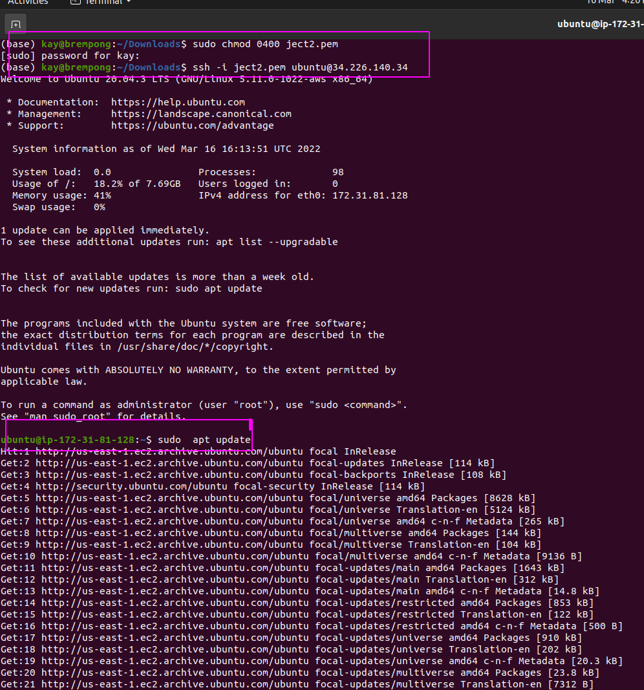
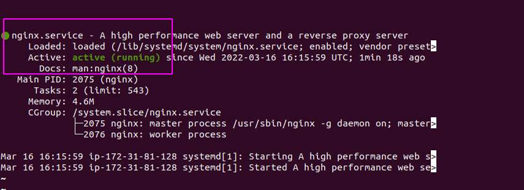
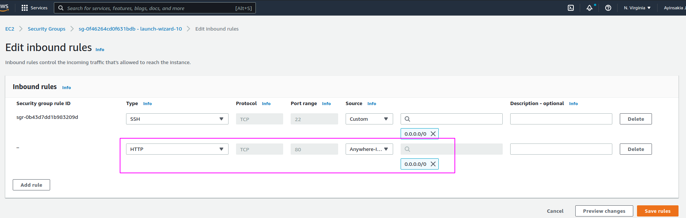
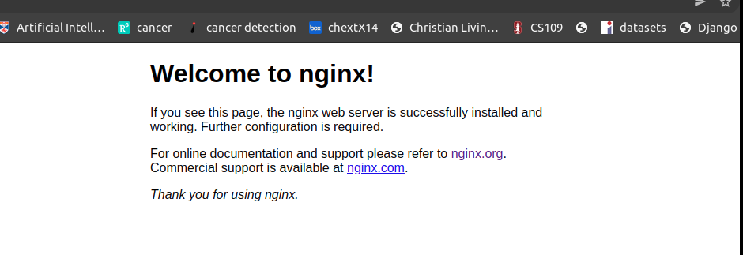
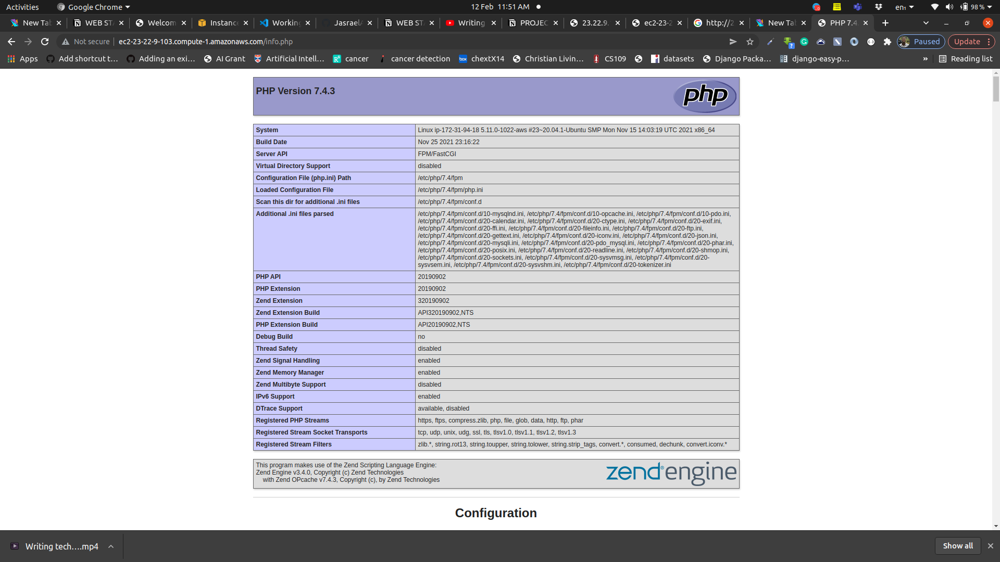
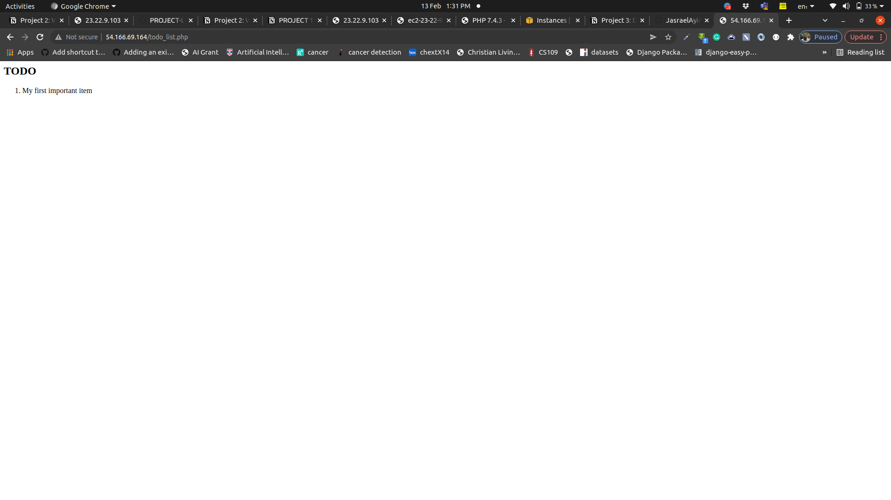

# LEMP-PROJECT2
                                                       PROJECT DETAILS

 This his project would help to cement hi/her skills of deploying Web solutions using LEMP stacks. So what is LEMP? LEMP=(Linux, Nginx, MySQL, PHP or Python, or Perl) as it focuses on - NGINX, which is also very popular and widely used by many websites in the Internet.

 PROJECT STEPS

Since LEMP factors Linux, Nginx, MySQL, PHP or Python, or Perl, we will do this project step-wise which is up to 6 steps.

STEP 1- Installing the Nginx Web Server

STEP 2- Installing MySQL

STEP 3- Installing PHP

STEP 4- Configuring Nginx to use PHP Processor

STEP 5- Testing PHP with Nginx

STEP 6- Retrieving data from MySQL database with PHP

                                      PREREQUITES FOR A SUCCESSFUL LEMP PROJECT

To complete this LEMP project, one must need an AWS account and a virtual server with Ubuntu Server OS. create a new EC2 Instance of t2.nano family with Ubuntu Server 20.04 LTS (HVM) image. It's worth noting to STOP EC2 nstances if not in use do as to save more free available hours from the Fee Tier. To connect your EC2 instace to your local terminal, you need to download, install and Launch Git Bash and run following command if using windows. You then run this command ssh -i <Your-private-key.pem> ubuntu@<EC2-Public-IP-address>

                                          STEP 1 INSTALLING NGINX WEB SERVER

I. It's needful to update your server's package index before installing Nginx. To do so, run the following :

$ sudo apt update
$ sudo apt install nginx

when prompted, enter Y to confirm that you want to install Nginx. Once the installation is finished, the Nginx web server will be active and running on your Ubuntu 20.04 server.

II.To verify that nginx was successfully installed and is running as a service in Ubuntu, run:

$ sudo systemctl status nginx

If it is green and running, then you did everything correctly - you have just launched your first Web Server in the Clouds!

III. You need to open TCP port 80 so as to receive traffic by the web server. Since TCP port 22 is opened by default on your EC2 to access vai SSH, add a rule to the configuration to open connection thhrough port 80.

IV.You can run the following commands to check how it can access it locally in our Ubuntu shell:

$ curl http://localhost:80

 or $ curl http://127.0.0.1:80

V.You can test to see how your Nginx server can respond to requests from the Internet. Open a web browser of your choice and try to access following url

http://<Public-IP-Address>:80

The URL in browser shall also work if you do not specify port number since all web browsers use port 80 by default. If you see following page, then your web server is now correctly installed and accessible through your firewall.

                                                   STEP 2  INSTALLING MySQL

Since the web server up and running, you need to install a Database Management System (DBMS) to be able to store and manage data for your site in a relational database. MySQL is a popular relational database management system used within PHP environments, so you can use it for tj
his project.

I. use this command to acquire and install this software:

$ sudo apt install mysql-server

When prompted, confirm installation by typing Y, and then ENTER.

II.When the installation is finished, it’s recommended that you run a security script that comes pre-installed with MySQL. This script will remove some insecure default settings and lock down access to your database system. Start the interactive script by running:

$ sudo mysql_secure_installation

This will ask if you want to configure the VALIDATE PASSWORD PLUGIN. Answer Y for yes, or anything else to continue without enabling. NB: its worthnoting that enabling this feature is something of a judgment call and would require three levels of password validation policy which you choose according to your discretion and decision.

III.When you’re finished, test if you’re able to log in to the MySQL console by typing:

`$ sudo mysql`

This will connect to the MySQL server as the administrative database user **root**, which is inferred by the use of `sudo` when running this command.

IV. To exit the MySQL console, type:

`mysql> exit`

                                                        STEP 3  INSTALLING PHP

You have Nginx installed to serve your content and MySQL installed to store and manage your data. Now you can install PHP to process code and generate dynamic content for the web server.

Nginx requires an external program to handle PHP processing and act as a bridge between the PHP interpreter itself and the web server. This allows for a better overall performance in most PHP-based websites, but it requires additional configuration. You’ll need to install php-fpm, which stands for “PHP fastCGI process manager”, and tell Nginx to pass PHP requests to this software for processing. Additionally, you’ll need php-mysql, a PHP module that allows PHP to communicate with MySQL-based databases. Core PHP packages will automatically be installed as dependencies.

I. To install these 2 packages at once, run:

`$ sudo apt install php-fpm php-mysql`

When prompted, type `Y` and press `ENTER` to confirm installation.

                                              STEP 4 CONFIGURING NGINX TO USE PHP                  

To fully configure nginx to use PHP,  run the following commands:

I.Create the root web directory for **your_domain** as follows:

`$ sudo mkdir /var/www/projectLEMP`

II. Assign ownership of the directory with the $USER environment variable, which will reference your current system user:

`$ sudo chown -R $USER:$USER /var/www/projectLEMP`

III. open a new configuration file in Nginx’s `sites-available` directory using your preferred command-line editor. Here, we’ll use `nano`:

`$ sudo nano /etc/nginx/sites-available/projectLEMP`

This will create a new blank file. Paste in the following bare-bones configuration:

`#/etc/nginx/sites-available/projectLEMP

server {
    listen 80;
    server_name projectLEMP www.projectLEMP;
    root /var/www/projectLEMP;

    index index.html index.htm index.php;

    location / {
        try_files $uri $uri/ =404;
    }

    location ~ \.php$ {
        include snippets/fastcgi-php.conf;
        fastcgi_pass unix:/var/run/php/php7.4-fpm.sock;
     }

    location ~ /\.ht {
        deny all;
    }

}`

IV. When you’re done editing, save and close the file. If you’re using `nano`, you can do so by typing `CTRL+X` and then `y` and `ENTER` to confirm.

V.  Activate your configuration by linking to the config file from Nginx’s `sites-enabled` directory:

`$ sudo ln -s /etc/nginx/sites-available/projectLEMP /etc/nginx/sites-enabled/`

This will tell Nginx to use the configuration next time it is reloaded. You can test your configuration for syntax errors by typing:

`$ sudo nginx -t`

You shall see following message:

`nginx: the configuration file /etc/nginx/nginx.conf syntax **is** ok
nginx: configuration file /etc/nginx/nginx.conf test **is** successful`

VI. We also need to disable default Nginx host that is currently configured to listen on port 80, for this run:

`sudo unlink /etc/nginx/sites-enabled/default`

VII. When you are ready, reload Nginx to apply the changes:

`$ sudo systemctl reload nginx`

Your new website is now active, but the web root /var/www/projectLEMP is still empty. Create an index.html file in that location so that we can test that your new server block works as expected:

`sudo echo 'Hello LEMP from hostname' $(curl -s http://169.254.169.254/latest/meta-data/public-hostname) 'with public IP' $(curl -s http://169.254.169.254/latest/meta-data/public-ipv4) > /var/www/projectLEMP/index.html`

VIII. Now go to your browser and try to open your website URL using IP address:

`http://<Public-IP-Address>:80`

If you see the text from ***‘echo’*** command you wrote to index.html file, then it means your Nginx site is working as expected.

Your LEMP stack is now fully configured. In the next step, we’ll create a PHP script to test that Nginx is in fact able to handle .php files within your newly configured website.

                                                     STEP 5 TESTING PHP WITH NGINX

Your LEMP stack should now be completely set up.

At this point, your LEMP stack is completely installed and fully operational.

You can test it to validate that Nginx can correctly hand `.php` files off to your PHP processor.

I. You can do this by creating a test PHP file in your document root. Open a new file called `info.php` within your document root in your text editor:

`$ nano /var/www/projectLEMP/info.php`

Type or paste the following lines into the new file. This is valid PHP code that will return information about your server:

`<?php
phpinfo();`

II. You can now access this page in your web browser by visiting the domain name or public IP address you’ve set up in your Nginx configuration file, followed by `/info.php`:

`http://`server_domain_or_IP`/info.php`

You will see a web page containing detailed information about your server:

III. After checking the relevant information about your PHP server through that page, it’s best to remove the file you created as it contains sensitive information about your PHP environment and your Ubuntu server. You can use `rm` to remove that file:

`$ sudo rm /var/www/your_domain/info.php`

You can always regenerate this file if you need it later.

                                           STEP 6 RETRIEVING DATA FROM MYSQL DATABASE WITH PHP 

In this step you will create a test database (DB) with simple “To do list” and configure access to it, so the Nginx website would be able to query data from the DB and display it.

We will create a database named example_database and a user named example_user, but you can replace these names with different values.

I. First, connect to the MySQL console using the **root** account:

`$ sudo mysql`

II. To create a new database, run the following command from your MySQL console:

`mysql> CREATE DATABASE `example_database`;`

Now you can create a new user and grant him full privileges on the database you have just created.

The following command creates a new user named `example_user`, using mysql_native_password as default authentication method. We’re defining this user’s password as `password`, but you should replace this value with a secure password of your own choosing.

`mysql>  CREATE USER 'example_user'@'%' IDENTIFIED WITH mysql_native_password BY 'password';`

III. Now we need to give this user permission over the `example_database` database:

`mysql> GRANT ALL ON example_database.* TO 'example_user'@'%';`

IV. Now exit the MySQL shell with:

`mysql> exit`

V. To test if the new user has the proper permissions by logging in to the MySQL console again, this time using the custom user credentials:

`$ mysql -u example_user -p`

Notice the `-p` flag in this command, which will prompt you for the password used when creating the `example_user` user. After logging in to the MySQL console, confirm that you have access to the `example_database` database:

`mysql> SHOW DATABASES;`

VI. Next, we’ll create a test table named **todo_list**. From the MySQL console, run the following statement:

`CREATE TABLE example_database.todo_list (
mysql>     item_id INT AUTO_INCREMENT,
mysql>     content VARCHAR(255),
mysql>     PRIMARY KEY(item_id)
mysql> );`

Insert a few rows of content in the test table. You might want to repeat the next command a few times, using different VALUES:

`mysql> INSERT INTO example_database.todo_list (content) VALUES ("My first important item");`

VII. To confirm that the data was successfully saved to your table, run:

`mysql>  SELECT * FROM example_database.todo_list;`

You’ll see the following output:

`Output
+---------+--------------------------+
| item_id | content                  |
+---------+--------------------------+
|       1 | My first important item  |
|       2 | My second important item |
|       3 | My third important item  |
|       4 | **and** this one more thing  |
+---------+--------------------------+
4 rows **in** set (0.000 sec)`

VIII.After confirming that you have valid data in your test table, you can exit the MySQL console:

`mysql> exit`

Now you can create a PHP script that will connect to MySQL and query for your content. Create a new PHP file in your custom web root directory using your preferred editor. We’ll use vi for that:

`$ nano /var/www/projectLEMP/todo_list.php`

The following PHP script connects to the MySQL database and queries for the content of the **todo_list** table, displays the results in a list. If there is a problem with the database connection, it will throw an exception.

Copy this content into your `todo_list.php` script:

`<?php
$user = "example_user";
$password = "password";
$database = "example_database";
$table = "todo_list";

try {
  $db = new PDO("mysql:host=localhost;dbname=$database", $user, $password);
  echo "<h2>TODO</h2><ol>";
  foreach($db->query("SELECT content FROM $table") as $row) {
    echo "<li>" . $row['content'] . "</li>";
  }
  echo "</ol>";
} catch (PDOException $e) {
    print "Error!: " . $e->getMessage() . " ";
    die();
}`

Save and close the file when you are done editing.

IX. You can now access this page in your web browser by visiting the domain name or public IP address configured for your website, followed by `/todo_list.php:`

`http://<Public_domain_or_IP>/todo_list.php`

You should see a page like this, showing the content you’ve inserted in your test table:

NB: IF THERE ARE EC2 INSTANCES RUNNING AFTER  THIS PROJECT, KINDLY STOP THEM.
